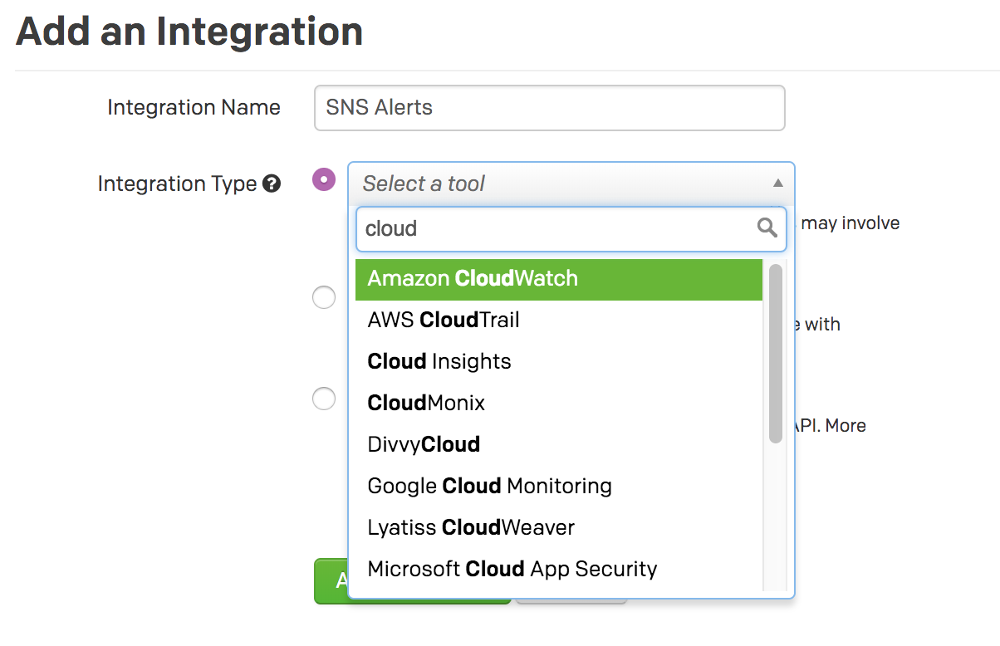
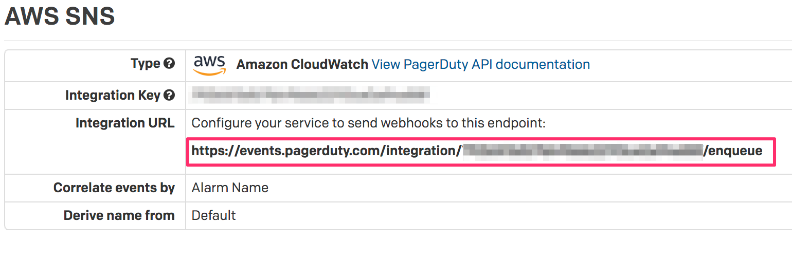
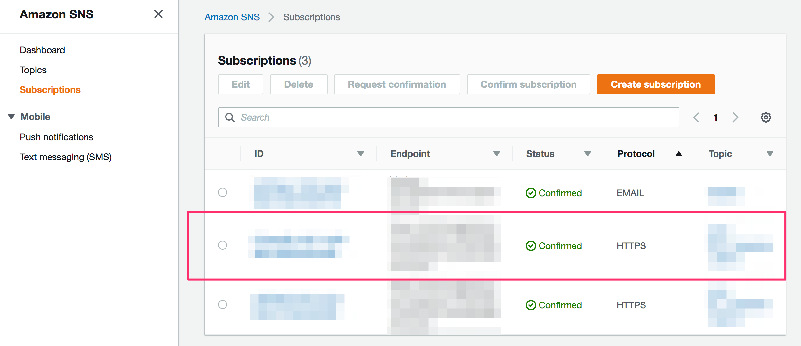
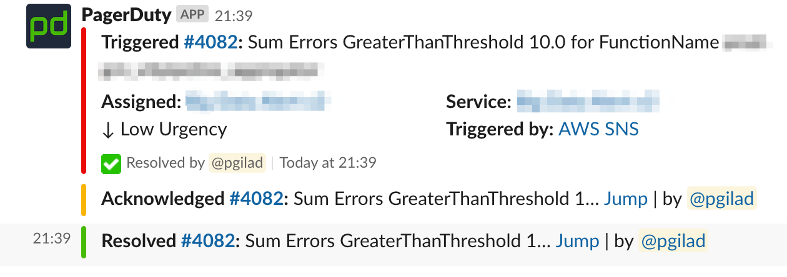

Automatically reporting alerts using AWS SNS Subscription to Pagerduty is super easy,
especially with Terraform. I recently attempted to integrate the services using email subscription,
but found that because of the async nature of email confirmation it isn't supported
on [Terraform](https://www.terraform.io/docs/providers/aws/r/sns_topic_subscription.html#email).
I found various [hacks](https://groups.google.com/forum/#!topic/terraform-tool/X1CFPcdRXIA) on how to 
bypass it, but they all felt dirty, and had leftovers when you deleted the resource.

Luckily, [Pagerduty](https://www.pagerduty.com/) already comes equipped with integrations 
ready for AWS. It's called `Amazon Cloudwatch` which is easily integrated with SNS as a topic subscription.

For brevity, I skip some of the infrastructure creation code (such as the lambda functions).

## An example alarm

```hcl
resource "aws_cloudwatch_metric_alarm" "ingestor_fan_out" {
  alarm_name          = "${aws_lambda_function.ingestor_fan_out.function_name} lambda errors"
  comparison_operator = "GreaterThanThreshold"
  evaluation_periods  = "5"
  metric_name         = "Errors"
  namespace           = "AWS/Lambda"
  period              = "60"
  statistic           = "Sum"
  threshold           = "10"
  alarm_description   = "ingestor_fan_out alarm"
  treat_missing_data  = "notBreaching"
  alarm_actions       = ["${aws_sns_topic.alarms.arn}"]
  actions_enabled     = true

  dimensions {
    FunctionName = "${aws_lambda_function.ingestor_fan_out.function_name}"
  }
}
```

This is an alarm we automatically setup to alert when a specific AWS lambda function starts to error.
The important point to note is the `alarm_actions` which binds this alarm to the sns topic we'll see in the
next section.

## SNS Topic For Alerts

```hcl
resource "aws_sns_topic" "alarms" {
  name = "${var.env_name}_${var.project_name}_alarms"
}
```

Simple yet effective. The topic by itself won't do anything without any subscriptions to it, so we need
to connect our Pagerduty service to it.

## Pagerduty Service

Create a new Service in Pagerduty with your favorite definitions. Then add a new `Amazon Cloudwatch` integration:



The next step is to find the integration endpoint. Click on the integration name when inside the
"Service Details" page. Then you'll find your integration endpoint:



## Creating the SNS Topic Subscription

Because we maintain multiple variations (environments) of our AWS infrastructure, we will use
a Terraform variable to conditionally hold the endpoint url:

```hcl
variable "pagerduty_alerts_endpoint" {
  type    = "string"
  default = ""
}
```

The default is an empty string which will aid us in detecting whether the user wants the integration
to happen (in production environments) or does not (in development environments).

Next, we define the topic subscription:

```hcl
resource "aws_sns_topic_subscription" "cloudwatch_alarms" {
  count = "${var.pagerduty_alerts_endpoint != "" ? 1 : 0}"

  endpoint               = "${var.pagerduty_alerts_endpoint}"
  endpoint_auto_confirms = true
  protocol               = "https"
  topic_arn              = "${aws_sns_topic.alarms.arn}"
}
```

We use the annoying yet working<sup>TM</sup> "play" on the `count` property, so that if the endpoint
variable is unset (is the empty string) we don't perform the subscription.

Also note the `endpoint_auto_confirms` which is a required flag for Terraform when using `https` integration
with an endpoint that can auto-confirm the subscription, like Pagerduty does.

## Verifying Results

Run `terraform apply` and then after it's done, head out to AWS Console to verify that the subscription
was made correctly.

Check out `AWS SNS -> Subscriptions`:



And we can see that our subscription was automatically setup and confirmed with Pagerduty.

To the grand finale, let's simulate our alarm going berserk and verify our Pagerduty integration works
(You will need to have `aws cli` configured for that account):

**Make sure to alert your team mates beforehand to prevent panic** :wink:

```bash
$ aws cloudwatch set-alarm-state --alarm-name "prod lambda errors" --state-value ALARM --state-reason "testing purposes"
```

This should fire your Pagerduty integration. I haven't discussed on how to setup notification channels
with Pagerduty, but we set Slack channel alerts:



Yep, we are ready for Pagerduty harassment alerts in the middle of the night. Now it's on us
to make sure these alerts never get triggered, as much as we can help it.
