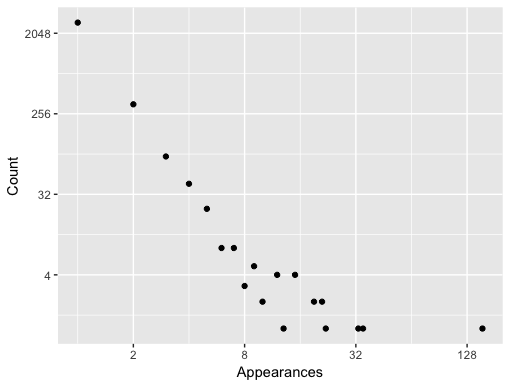

I read Kent Beck's [Conditions Are Power-Law Distributed: An Example](https://medium.com/@kentbeck_7670/conditions-are-power-law-distributed-an-example-61fa4e0d3500)
today, and it made perfect sense. In a codebase there are lots of conditions used once, and few
conditions used many times, the distribution following a [power law](https://en.wikipedia.org/wiki/Power_law).

Kent had some Bash code that he wrote to extract the distributions, but written for Python ifs,
and I needed to adjust it to our Javascript/Typescript codebase (Currently of 304K lines):

```bash
$ grep -R --include='*.js' 'if ' app | \
 perl -nle 'print $1 if /.*if\s*\((.*)\) /' | \
 sort | uniq -c | sort -n -r | \
 awk '{ print $1}' | sort -n | uniq -c
2696 1
 327 2
  85 3
  42 4
  22 5
   8 6
   8 7
   3 8
   5 9
   2 10
   4 12
   1 13
   4 15
   2 19
   2 21
   1 22
   1 33
   1 35
   1 155
```

My goto tool for plotting is R (and R Studio) so let's output to a text file named `data.txt`.

Opening it in R Studio I ran the following code (And isn't R amazing?)

```r
library(ggplot2)

data <- read.table("data.txt", col.names = c("Count", "Appearances"))
ggplot(data, aes(Appearances, Count)) + geom_point() +
    scale_x_continuous(trans='log2') + scale_y_continuous(trans='log2')
```

This already adjusts the scales to be log2 based and we get a very similar power law distribution
to Kent Beck's results.



Awesome!
