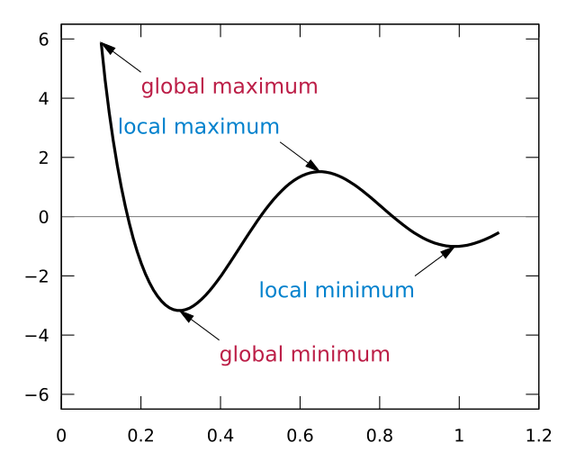

I've recently finished reading John C. Maxwell's [The 5 Levels of Leadership](https://amzn.to/2NMv5rJ) - an excellent analysis of the levels of leadership, categorized by the manager's influence.

Although the author's descriptions and points are mostly spot-on, I've found that the book doesn't cover the interactions of the leader with
his peers and colleagues. Leadership is not only about how well you lead and improve the people that report to you. It's also not only about how well you or your team performs. Leadership is also about how you can (positively) influence the other teams and leaders that are parallel to you. I've personally struggled with colleagues focusing on creating silos, working hard on showing why their team is the best, while
naïvely, or sometimes deliberately, harming their peers' teams.

I think the term "Us Vs. Them" neatly categorizes the mindset of the leader in respect to how they interact with subordinates and peers. This scale doesn't contradict Maxwell's leadership scale, and they might not be correlated. Still, the levels are very distinct and identifiable.

The levels of "Us Vs. Them" that I see are:

1. **Me Vs. You**: The leader sees himself above everyone else, including his subordinates.

2. **Us (Team) Vs. Them**: The leader sets his team to be **Us** while everyone else, including peers and peer teams, is **Them**.

3. **Us (Group) Vs. Them**: Even though the leader does not necessarily manage the group, that includes peer teams, he sets a mentality that the
   group is **Us** and other groups in the organization are **Them**. The success of the group is important to the leader, almost as much as the success of his own team.

4. **Us (Organization) Vs Them**: While not necessarily being the head of the organization, the leader instates that the organization is **Us**
   while competing companies are **Them**. Leaders in this position are naturally recognized as distinct encompassing leaders in their organization, providing value and leadership not only to their teams, but to their peer teams, and other groups in the organization. This leadership level is extremely rare to come by, or to reach. Smaller organizations, startups for example, have a strong inclination to attract or create leaders at this level, while large organizations deter these kinds of leaders.

5. **Us (Industry) Vs Them**: Industry leaders can create an effect far greater than their own organization, attracting people from all kinds of industries and professions to join their industry or profession. These are very unique kinds of leaders, that besides their usual job of CEO or other high ranking position, also create a positive vibe for their whole industry. Think about visionaries such as Steve Jobs, attracting people both to tech industry, but also paving the way for designers, creating beautiful user experience for customers.

It's important to mention that a leader can be partly at multiple levels at once, can traverse between levels, and can be at multiple levels with different people. I'm also guilty of some of the negative behavior I depict, and I've done my best to improve and grow.

## Me Vs. You

This level usually depicts novice leaders. Their mindset focuses on how they can improve themselves and their own position, and how they can harness the environment to increase their influence. In fact this leader's main leverage is taking, not giving. At this level the leader aims to perform and impress. The performance part is usually not to the gain of the company, that's a side effect, as it's usually aimed to impress his superiors, or sometimes even intimidate his peers.

The signs of this leader are:

-   He takes all the credit for things he does, sometimes for things the team has achieved.

-   His peers ignore him, and are sometimes intimidated by him.

-   He will prefer taking small and achievable tasks so that the gain is most certain.

-   In larger meets, he will be the one speaking, never a member of his team.

-   His team members might leave the team or the organization, and he might be a reason for it.

-   Praise for one of his team members will intimidate him unless it follows praise for him. This is because of fear of competition. The leader always needs to be the shiniest star.

-   Coaching and training of his team members is rarely and sporadically done. Only if he has to.

Are leaders in this level always beginner leaders? My experience is that most of them are. But there are some leaders who don't succeed in ever growing beyond this level due to many possible reasons. Some have confidence (or rather lack of) issues. Some never got the proper training and could not advance on their own. Some are power driven and have some sort of "Me vs. the world" mentality they never surpass.

## Us (Team) Vs. Them

This level fits a classic team lead mentality, and perhaps the most popular one. I believe most team leads will start in this level or the **Me Vs. You** level. In this level, the leader see himself as part of the team. His success can be tied to the success of the team.

The good news are that in this level the leader invests in the team. He will train and coach the team members, praising them without requiring himself to be praised along. He will hold team events, forging team spirit and morale.

In larger meets, it's not uncommon that leaders at this level will let, and sometimes even encourage their team members speak. After all, their success is the leader's success. The team thrives at this level, enjoying higher productivity levels.

The leader at this level will sometimes take more challenging tasks. This is a chance for even better team morale, passing tough challenges will bring them even more together.

Team members sometimes leave, but it's almost never because of the leader, but rather circumstances, a rare opportunity or life changes.

To the naïve observer, it may seen that this is the optimal leadership level for the organization. The leader makes his team happy, improves their skills by coaching and the team usually performs. But the honest truth is that leaders at this level can be very harmful to the organization, because they solve for the local (team) maximum, it's very rare that this correlates with the global (organization) maximum. In fact I've personally experienced leaders at this level creating all sorts of havoc and chaos in the organization, while taking their team to the top.

Because the leaders of this level are so focused on their team, they forget about the group, and the organization. Everything justifies the cause of their team's success. This creates an atmosphere of **Us Vs. Them** for the team. The competition are other teams, other team leads, their colleagues. Accentuating their team at the expense of other teams is very common. Other signs of this behavior can be:

-   Creating a mindset that only the team matters. The other teams can (and perhaps should) crash and burn for all they care.

-   Competition with other teams can be unhealthy. All means are ok for winning.

-   Panicking if other teams or leaders get praise. Especially if praise for the leader's team doesn't follow.

-   Having team events. Never inviting other teams.

-   When creating solutions and improvements, the natural tendency is to keep it locally for the team. After all, if other teams improve, they can overshadow the leader's team.

-   Technical and skill improvements are always done locally for the team, never shared.

-   When members from other teams or their leaders leave the organization, this leader is sometimes one of the reasons. You see, the leader at this level can leave a "Scorched Earth" of a sort for the other teams and colleagues. Team members of other teams suffer from this greatly. After all they are all part of the same group and organization, but are receiving the cold shoulder or un-helpful behavior from this leader. Improving and helping them is not to his interest, so he believes.

In one of the companies I worked for, we've had one clear and distinct level 2 leader. It took him a while to switch from level 1 to level 2, but once he got there, he made his team successful. They had team events, team meets, he trained and improved his team members. In weekly meets it was common that he gave praises to his team members, usually encouraging them to speak at the bi-weekly demo.

On the opposite coin, he created fierce and unhealthy competition with other teams. It doesn't seem deliberate, but rather a consequence of the mindset that only his team matters. Members of other teams usually received bad treatment and cold shoulder from this leader, and his team members learnt from him that this is the desired behavior. These are things he would almost never do to his own team members. Other leaders were the competition and he tried his best to increase his, and his team's, influence at the company, at the expense of other teams.

I've personally known 3 employees that left, mostly for other reasons, but they all had in common the fact that they specifically mentioned him as a trigger or partial reason for leaving. The fierce competition leaves causalities on the battlefield. They are mostly peers and other team members. I've also suffered from competition with this leader, unable to help him rise above level 2. It also didn't help that his managers were oblivious to his behavior. They ignored it by being blind to it, or being incapable of handling the situation.

Leaders at this level usually present a double-edged sword to management. On one hand they can be very productive, both personally and team-wise. On the other hand, they can be very destructive to their peer teams and colleagues. If the leader is unable to rise to the next level, management needs to make tough decisions. Is it worth it?

## Us (Group) Vs. Them

Leaders at this level are able to rise above the mindset that their team is all that counts. They understand the bigger picture, and know that they can improve their team alongside their peers and peer teams, and it will in-turn improve the organization. A leader being able to reach this level will internally count on reciprocity from peers, and believe that one needs to be the change one wants to see.

The leaders at this level aim to train and coach members from all their peer teams. They strive to hold mutual team events and share knowledge with other teams. This will pay back in dividends when colleagues and other team members will hold similar events. It also improve cross team communication, a soft skill that software developers tend to be weaker in.

The members of the group thrive. The competition between teams is healthy, and never at the expense of the greater good of the group. Members occasionally switch teams in order to learn, improve and widen their scope and practice. Mutual praises between peer leaders and teams can happen and even further improve group morale.

This leader always strives to improve her co-leaders. She isn't scared or intimidated by colleagues and sees their success as her success. She picks up challenging tasks, sometimes encompassing her own team's scope in order to improve the group's coordination skills.

Because group improvements takes effort and time, this leader strives to make her own team as autonomous as possible. No longer can this leader be a single point of failure for the team, and she trains and encourages subordinates to step up and get more responsibility, paving the road for future leadership generation.

This is the "golden field" for leaders. They bring their team and group much further and higher, and everyone benefits. Other groups can be jealous or envious of the group this leader is in, as they usually do not benefit from the influence of the leader, besides the improvements that the organization receives as business gains.

The leaders in this level are rare and scarce, as it takes dedication and perspiration to reach it. And tenure. It's very difficult to simply join an organization and start at this level. Leaders must first prove themselves to their own teams, and only later to their peers.

Not everyone is happy with this leader. Some peer leaders will fail to see the gain and benefit, and in turn reject any help from this leader. A helping hand reaching out can be perceived as an indication for intervention and takeover attempts. For a company I worked for, I've had a peer consistently reacting to any help I offered with a bigger push-back. For him, I was the competition, and it was a [Zero-Sum Game](https://en.wikipedia.org/wiki/Zero-sum_game). My gain is his loss.

## Us (Organization) Vs. Them

I'm not talking about obvious organization leaders, whose role is to lead the company. It couldn't surprise us more that the CEO tries to unify the organization. We need to "pinch in" and look at more local leaders, who somehow manage to harness the entire power of the organization in order to take the entire company to a higher level.

They lead cross-group tasks and they educate everyone around them. They have an holistic approach and mindset about the organization. To them, the competition are other industry firms. Everyone in the company is part of **The Team** and they never treat other employees, even from other groups as foreigners.

These leaders are extremely rare and more often found in smaller companies, like startups, where everyone is co-located and grouped together to solve a common challenge or reach a common goal. Leaders at this level are great politicians, being able to influence people way beyond their group for a common cause.

In a sense, leaders at this level make the **Them** redundant. Because the competition is so far away and invisible, essentially the rallying cause is the **Us**. It's what we can do together, what we want to do and achieve, those are the common uniting themes.

## Us (Industry) Vs Them

Not much to add about these kind of unique leaders. They manage to rise above a local (large as it may) organization, and be industry leaders. In a sense they make their profession and industry so appealing, that others want to join in. People want to work in their company for the sake of being closer to their influence.

## Closing Words

Leadership is influence, but it is also about how you influence your peers and environment. Being able to navigate through the company's political turmoil is tough and challenging. You will encounter fierce and ruthless competition, sometimes playing unfairly, simply because their scope is different. But the rewards are great, and greater power is greater influence and for that I also hope that you will use the power to do good.

Periodically stop and think to yourself about your scope of **Us** and **Them**. You will notice these terms change over time, and always be aware of your limiting mindset about who is the competition.
