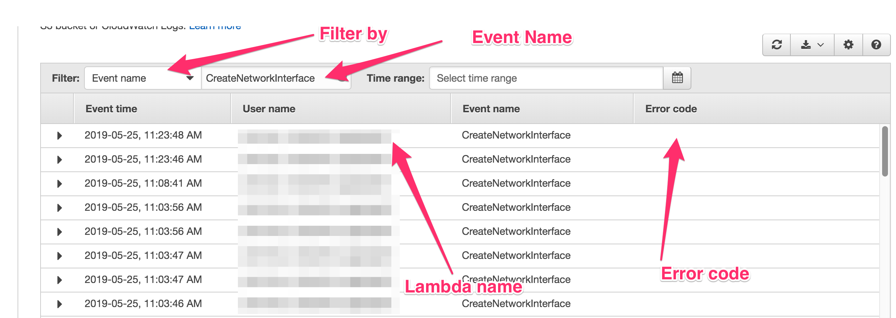

Lambda technology is often decorated with misleading superlatives, such as "unlimited scale" and "no ops". In our data-pipeline project I found that working with AWS Lambda functions at scale, meaning
thousands of concurrent operations a second, and especially running them inside a VPC (more on the reasons in a second) will often bring up lots of unexpected problems, not advertised in advance.

Why would you choose to run your AWS lambda functions as [VPC-enabled](https://docs.aws.amazon.com/lambda/latest/dg/vpc.html)? The easy answer is that you are forced to. We are using an AWS ElastiCache (Redis) for some of our calculations storage,
and it has to be setup inside a VPC. If you have Lambda functions that interact with the ElastiCache, you must set them up in the same VPC. There are other services that required to be in a VPC, or perhaps some of your infrastructure is. Either way, running with VPC-enabled should be a last choice for the reasons we'll see soon.

The lambda functions are not infinitely scalable. Indeed - you are not forced to run an instance on EC2, some of the logging and monitoring is taking cared of (But brings up lots of other issues that come with distributed computing, also see [here](../aws-lambda-cloudwatch-logs-insights)). You will still need ops and you will probably find yourself writing Terraform files to setup all the infrastructure. You are initially limited to 1000 concurrent lambda executions per account-region. This limit can be raised, but not by that much. If you have serious spikes in executions (read: thousands or ten-thousands of executions per second), you will run into throttling. Debugging is hard, very hard, especially compared to process breakpoints.

There are other general limitations, I invite you to read this white-paper critically titled [Serverless Computing: One Step Forward, Two Steps Back](https://arxiv.org/pdf/1812.03651.pdf).

We particularly ran into 3 major problems when running lambda functions inside VPC:

1. `EC2ThrottledException` - If your VPC does not have sufficient ENIs or subnet IPs. You will need to configure your VPC subnets (and consequently your VPC) to have sufficient IP addresses. We use `/18` for each subnet, meaning `3 * 16K` available IP addresses.

2. `Client.NetworkInterfaceLimitExceeded` - Running lambda functions inside a VPC requires each lambda to setup an `ENI` (Elastic Network Interface). There's a limit on the number of ENIs you have per region, this limit can be raised as well, but again - not infinitely scalable.

3. `Client.RequestLimitExceeded` - The lambda functions hit the request rate limit of creating network interfaces (`ENIs`). This is by far the most annoying and limiting of the bunch, if you have concurrency spikes in your lambda functions, you will most likely run into this limit. Our limit used to be `300` and we increased it to `600`, but we are still running into this throttling errors occasionally.

One of the more annoying issues is the error discovery. If your lambda functions fail due to one of the above errors, you will see the errors in the CloudWatch Metrics (Lambda Errors), but you won't see anything in the CloudWatch Logs. This forces you to go over to AWS CloudTrail, where the error is again, not easily discoverable.

You will need to filter by `Event name` and enter `CreateNetworkInterface` as the event name. Then look for `Error codes`:

There's an [open issue](https://forums.aws.amazon.com/message.jspa?messageID=640422#640422) for AWS CloudTrail to add the ability to filter by `Error code` that's open for roughly 4 years. That'll be really helpful.

You could download csv logs of your CloudTrail and filter them, or dump them into AWS Athena, but that's a lot of work just to find why your lambda function error :sweat:

## Summary

If you have a need for serious concurrent executions, lambda functions might not be the best fit. Do your best to avoid running Lambda functions inside VPC, unless you absolutely have to :pray:
