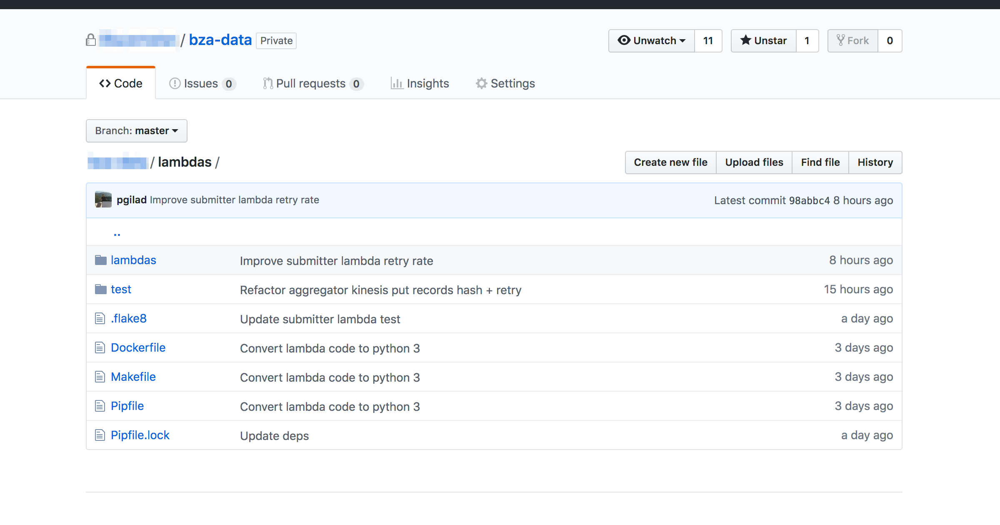

In this guide I'll explain how to package (zip) your AWS Lambda Python 2.7 code for deploying
it to your Lambda function. The main issue I stumbled upon was using [Pipenv](https://pipenv.readthedocs.io/en/latest/),
most of the guides explain how to handle dependencies with `requirements.txt`, but not with `Pipfile`.

I also like to fine-tune the process so that the Docker creation has optimized layers for caching.

Let's start with your directory structure:



This is the usual Python directory structure, with the package name as the source directory. Notice that 
this project doesn't have a `requirements.txt` in it, but a `Pipfile`.

After we are done coding, and want to package and deploy our code to AWS Lambda, it's not enough for us
to simply zip the source code. We also need to package the dependencies, in a flat hierarchy.
Pip has the option to install all dependencies to a target folder (with [`--target`](https://pip.pypa.io/en/stable/reference/pip_install/#cmdoption-t))
But Pipenv does not. It always creates a `virtualenv` with the dependencies.

There is a now closed thread on adding support for [flat dependency install](https://github.com/pypa/pipenv/issues/746)
in Pipenv but it doesn't look like it's going to be implemented.

In order to consistently reproduce our code archive, both on our computer, and on the CI server
(Be it Travis, Jenkins or whatever else), and also in order to allow other developers to package the code
without having to install all required dependencies on their system, we want to use Docker for it.

## The Dockerfile

Let's checkout the `Dockerfile` and explain afterwards:

```docker
FROM amazonlinux:2

RUN yum -y update && yum -y install gcc python-devel zip

RUN curl https://bootstrap.pypa.io/get-pip.py | python -
RUN pip install pipenv

ENV LANG en_US.UTF-8
ENV LC_ALL en_US.UTF-8
ENV PYTHONDONTWRITEBYTECODE 1

WORKDIR /app
COPY Pipfile* ./

RUN pipenv lock -r | sed 's/-e //g' | pip install -r /dev/stdin --target .
COPY lambdas ./
RUN find . -type f -iname '*.pyc' -delete && rm Pipfile*

RUN zip -r /tmp/code.zip .
```

Do note that the code might need minor adjustments if you use Python 3.
 
The code is self-explanatory, the key elements are:

- `COPY Pipfile* ./` - this will copy `Pipfile` and `Pipfile.lock` to the workdir. The reason
not to copy all files, is to create a caching layer for `pipenv lock`. This layer will only need to change
if the `Pipfile*` files changed.

- `RUN pipenv lock -r | sed 's/-e //g' | pip install -r /dev/stdin --target .` - This evil nasty
hack will create a list of dependencies and then use `pip install --target` to install them to workdir

I also like to make sure there aren't any leftover `.pyc` files. At the end I zip all the code
from the workdir to an archive in `tmp/code.zip` awaiting to be copied out of the docker image, and 
deployed to AWS Lambda function.

It's also important to note that only regular dependencies are installed, so development dependencies
stay out of the archive, lowering zip filesize.

## Creating the archive

Make sure you are in the lambda code directory, then run:

```bash
$ docker build . -t aws-lambda
$ CONTAINER_ID=$(docker create aws-lambda)
$ docker cp ${CONTAINER_ID}:/tmp/code.zip build.zip
$ docker rm ${CONTAINER_ID}
```

Which will build the docker, create a temp container with the image, copy the zip from the container and then
remove the container.

`build.zip` is ready to be uploaded to AWS.
