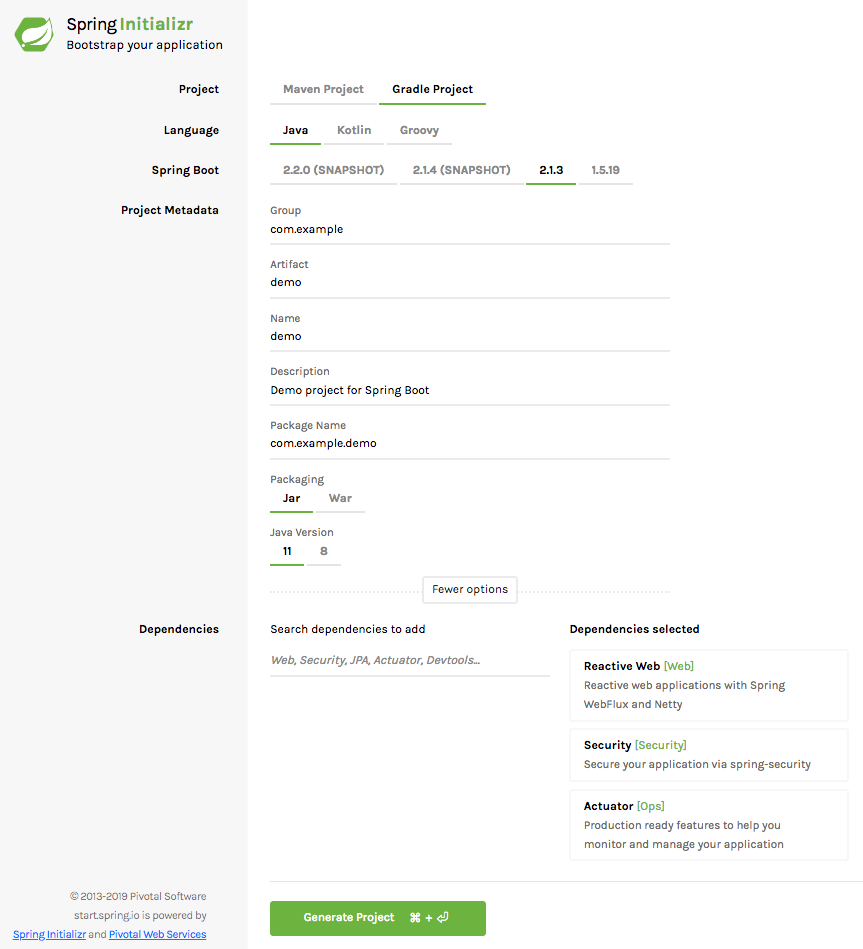
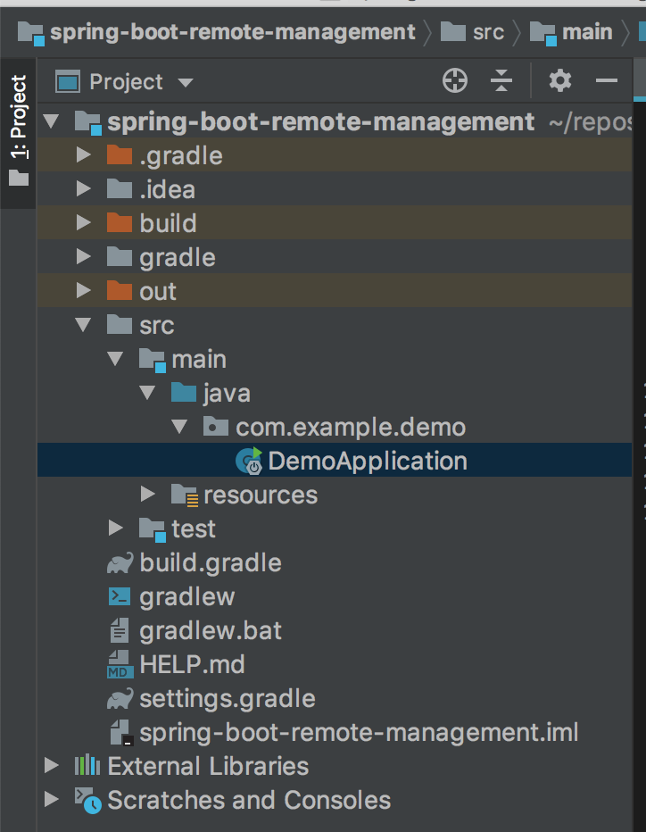
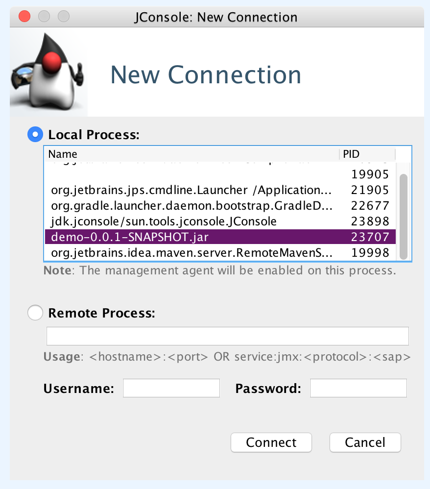
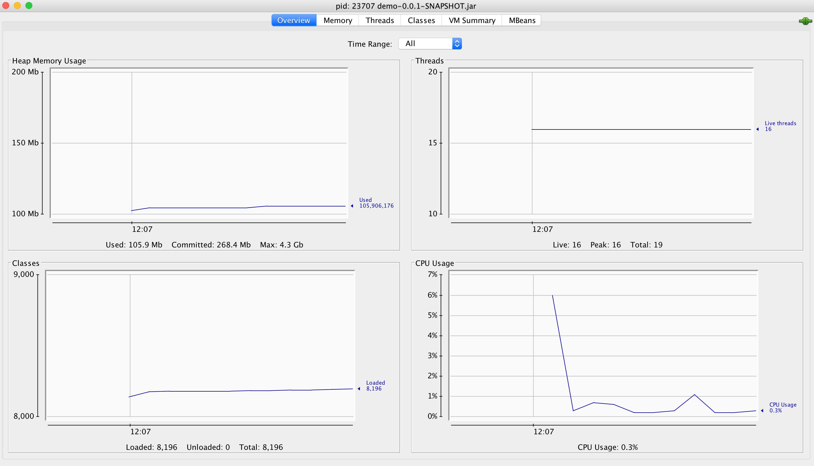
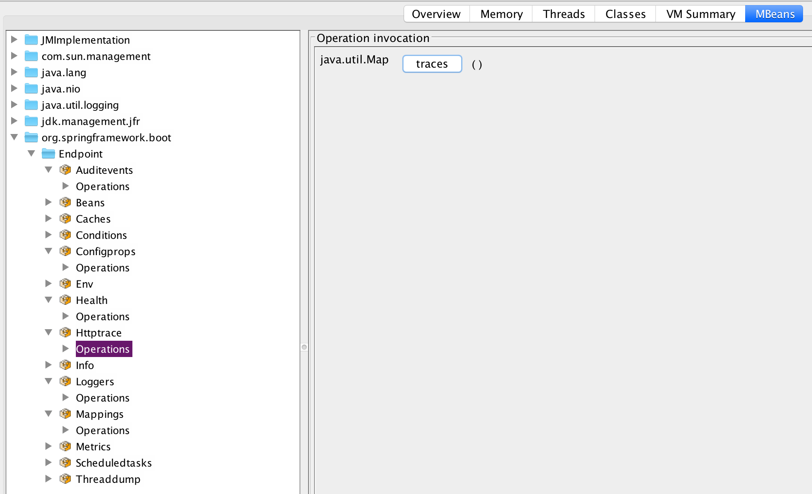

## Prefix

Debugging applications is a key part in any developer's toolkit. Debugging applications in non-development environment is
an even harder and more difficult challenge. It is only after your production application crashes, or you find yourself
spending many hours (or days) trying to reproduce the customer's state in your local development environment, you understand
how worthwhile it is to be able to inspect live apps.

Java, and it's underlining JVM, allows you to tap into the running JVM process, and besides monitoring and instrumenting, you are also
able to use [JMX](https://en.wikipedia.org/wiki/Java_Management_Extensions) and remote JMX to control and configure your application.

We have several Java applications in our workplace, one of them is a [Spring Boot Application](https://spring.io/projects/spring-boot).
Spring Boot is a powerful framework built on top of Spring, allowing easy, out-of-the-box, powerful bootstrap for a Java app.
Another awesome feature of Spring Boot is it's vast range of plugins. A very helpful one is [Spring Boot Actuator](https://www.baeldung.com/spring-boot-actuators).
It adds numerous debug and management endpoints, controlled via HTTP or JMX beans.

In this article we'll bootstrap a Spring Boot web application with a single endpoint. We'll run and test it locally, including using JConsole 
to profile the application. Then we'll spin up a remote machine (I'll use an AWS EC2 machine), copy the packaged JAR to it, and redo the previous
steps, but now remotely.

## Bootstrapping a Spring Boot app

My favorite goto place to bootstrap a Spring Boot app (besides copying the skeleton of an existing project) is [Spring Initializr](https://start.spring.io/).
You will need Java 11 installed on your development machine for this to work.

For this demo, I selected `Java 11`, `Gradle`, and the Spring Boot version `2.1.3`, with modules of `Reactive Web`, `Security` and `Actuator`.
We are not going to deep dive into any of these modules, so feel free to pick your other favorite modules.



Click on "Generate Project" - you will download a `demo.zip` which you should unzip somewhere. This will be our working directory.

I use [Jetbrains IntelliJ IDEA](https://www.jetbrains.com/idea/) as my IDE of choice, but feel free to use your favorite editor. 
Opening this project in IntelliJ IDEA should be a breeze (Everything is automatically setup for you). This should be your directory structure:



Running this application is easy (although it won't do much), but important to see that everything compiles.
Open `DemoApplication.java` and click on the little green arrow next to the class. Then "Run Application".
This should automatically start your application which should by default serve at port `8080`.

Our application currently doesn't do much, but we can interact with it's `actuator` endpoints, for example:

```bash
$ http :8080/actuator/health
HTTP/1.1 200 OK
Cache-Control: no-cache, no-store, max-age=0, must-revalidate
Content-Length: 15
Content-Type: application/vnd.spring-boot.actuator.v2+json;charset=UTF-8
Expires: 0
Pragma: no-cache
Referrer-Policy: no-referrer
X-Content-Type-Options: nosniff
X-Frame-Options: DENY
X-XSS-Protection: 1 ; mode=block

{
    "status": "UP"
}
```

And just for the fun of it, let's add an application information property. Add `info.app.kewl=aid` to `application.properties`.
(For a better deep-dive into actuator's info, see [this guide](https://www.baeldung.com/spring-boot-info-actuator-custom)).
Now let's query the info api:

```bash
$ http :8080/actuator/info
HTTP/1.1 200 OK
Cache-Control: no-cache, no-store, max-age=0, must-revalidate
Content-Length: 22
Content-Type: application/vnd.spring-boot.actuator.v2+json;charset=UTF-8
Expires: 0
Pragma: no-cache
Referrer-Policy: no-referrer
X-Content-Type-Options: nosniff
X-Frame-Options: DENY
X-XSS-Protection: 1 ; mode=block

{
    "app": {
        "kewl": "aid"
    }
}
```

Next step is to add a custom HTTP endpoint, create a new Java file named `DemoController.java` and paste this code:

```java
package com.example.demo;

import org.springframework.web.bind.annotation.GetMapping;
import org.springframework.web.bind.annotation.RestController;
import reactor.core.publisher.Mono;

@RestController
public class DemoController {

    @GetMapping("/ping")
    public Mono<String> ping() {
        return Mono.just("pong");
    }
}
```

As you can see, this amazingly sophisticated code awaits the user's `/ping` requests, and responds with a quick `pong`

```bash
$ http :8080/ping
HTTP/1.1 401 Unauthorized
Cache-Control: no-cache, no-store, max-age=0, must-revalidate
Expires: 0
Pragma: no-cache
Referrer-Policy: no-referrer
WWW-Authenticate: Basic realm="Realm"
X-Content-Type-Options: nosniff
X-Frame-Options: DENY
X-XSS-Protection: 1 ; mode=block
content-length: 0
```

Wait no... What's going on here? Because the fine people at Spring Boot believe in creating production grade application without
a big hassle, and because we added `Spring Boot Security`, all of our endpoints (including all of Actuator's endpoints besides `info` and `health`) are
protected by default. This is a great start, although a minor slowdown for us on this quick demo. The reason I opted to use it, is
because I find most guides skip this part, although it's a crucial part of any production application.

Because we haven't configured anything security related, Spring Boot Security uses the default user `user`, and the randomly generated password
is outputted when Spring Boot boots. The line to look for is this:

`Using generated security password: 9d3a723f-2e2a-4a3e-a819-4ba06c99f9ba`

To actually get a `pong` response from our API, we'll need to authenticate but no need to worry, it's easy:

```bash
$ http -a 'user:9d3a723f-2e2a-4a3e-a819-4ba06c99f9ba' :8080/ping
HTTP/1.1 200 OK
Cache-Control: no-cache, no-store, max-age=0, must-revalidate
Content-Length: 4
Content-Type: text/plain;charset=UTF-8
Expires: 0
Pragma: no-cache
Referrer-Policy: no-referrer
X-Content-Type-Options: nosniff
X-Frame-Options: DENY
X-XSS-Protection: 1 ; mode=block

pong
```

Nice.

## Creating and running a packaged JAR

Next step will be to create and run a packaged JAR, ready for deployment. Simply run `gradle build`. You will now have
the carefully crafted `build/libs/demo-0.0.1-SNAPSHOT.jar`. We'll run this JAR manually to see that everything still works:
(Don't forget to stop your application in IntelliJ to free up the port)

```bash
java -jar build/libs/demo-0.0.1-SNAPSHOT.jar
```

You can try out the previous endpoints to verify everything still works as it should. This jar is ready for deployment
(It contains all required dependencies, and our application compiled class off course).

## Using JConsole on a local process

Keep the application running. Let's use `jconsole` (bundled with Java) to profile it while it's running locally. No extra setup is required, run `jconsole`
in your shell, and find your running application `jar` in the list of local processes.



Click on "Insecure Connection" when you are bothered with a confirm window. You will see an overview of your application performance:



Another very interesting feature, is the MBeans (managed beans). This will allow us to interact with our Actuator endpoints. For example if we
invoke our `ping` endpoint (Don't forget to swap the password to the new password), then we can see a list of recent traces that Spring Boot Actuator traced.
This is found under the tab `MBeans -> org.springframework.boot -> Endpoint -> Httptrace -> Operations`.



When you click on `trace`, this invokes the `trace` endpoint using JMX, which should show you something like this:

```text
traces=[
    {
        timestamp=2019-03-05T10:12:09.546199Z,
        principal=null,
        session=null,
        request={method=GET, uri=http://localhost:8080/ping, headers={Accept=[*/*], User-Agent=[HTTPie/1.0.2], Connection=[keep-alive], Host=[localhost:8080], Accept-Encoding=[gzip, deflate]}, remoteAddress=null},
        response={status=200, headers={X-Frame-Options=[DENY], Referrer-Policy=[no-referrer], transfer-encoding=[chunked], Cache-Control=[no-cache, no-store, max-age=0, must-revalidate], X-Content-Type-Options=[nosniff], Pragma=[no-cache], Expires=[0], Content-Length=[4], X-XSS-Protection=[1 ; mode=block], Content-Type=[text/plain;charset=UTF-8]}},
        timeTaken=45
    }]
```

which is a list of recent traces, the most recent (and only one) is the `ping` API I invoked. Very handy for debugging.

## Running our application remotely

So for this part I spin up an EC2 machine, feel free to choose your own cloud poison (or any remote machine). Make sure that your security
group allows incoming tcp on port `8080` (our current server port), and `9090` (for remote JMX).
Also, needless to say, make sure you can ssh into the machine (port `22` using `ssh`).

I dislike having to manually use the remote machine's ip (or address), and enter all kinds of ssh information (username, security key), I configure
the machine in my `~/.ssh/config` file:

```text
Host server
    HostName ec2-11-11-111-111.eu-west-1.compute.amazonaws.com
    User ubuntu
    IdentityFile ~/.ssh/key.pem
```

Then you can easily `ssh` into the machine using `ssh server` without all the extra ceremonial hassle. I update dependencies and install Java 11. That is the
only requirement.

Next step would be to copy the jar file we created on the previous steps to the remote machine. This is again easily doing using `scp`:

```bash
$ ssh server
$ mkdir -p app
$ exit
$ scp build/libs/demo-0.0.1-SNAPSHOT.jar server:app
```

This will copy the jar to the folder `~/app` in the remote machine. Let's run it and make sure everything works remotely:

```bash
$ ssh server
$ java -jar ~/app/demo-0.0.1-SNAPSHOT.jar
```

Our server should boot app and we can test that our endpoints are working again, remotely.
If your request is getting stuck, it could be that your security group isn't allowing it, or some firewall issues.

```bash
$ http 11.11.111.111:8080/actuator/info
HTTP/1.1 200 OK
Cache-Control: no-cache, no-store, max-age=0, must-revalidate
Content-Length: 22
Content-Type: application/vnd.spring-boot.actuator.v2+json;charset=UTF-8
Expires: 0
Pragma: no-cache
Referrer-Policy: no-referrer
X-Content-Type-Options: nosniff
X-Frame-Options: DENY
X-XSS-Protection: 1 ; mode=block

{
    "app": {
        "kewl": "aid"
    }
}
```

And that is not the real IP off course. Our application is now up and running ready to serve real users

## Remote JMX

There are multiple ways to configure remote JMX, but all of them require us to boot up the application with some System Properties.
We will examine 2 ways to connect remotely:

- Over the internet using an IP
- Using local port forwarding (a.k.a tunneling)

For both of them, as an extra precaution, we'll setup remote JMX authentication. If you connect over the internet (using an IP)  
I also recommend you setup SSL as well.

### Connecting remotely over an IP

For this step we'll first create a startup script that helps us with automating the booting of our application.
Create a new file in the remote machine named `run-public.sh`:

```bash
#!/usr/bin/env bash

set -euo pipefail

RMI_HOST=$(wget -q -O - http://169.254.169.254/latest/meta-data/public-hostname)

java -Dcom.sun.management.jmxremote \
	-Djava.net.preferIPv4Stack=true \
	-Djava.rmi.server.hostname=${RMI_HOST} \
	-Dcom.sun.management.jmxremote.local.only=false \
	-Dcom.sun.management.jmxremote.port=9010 \
	-Dcom.sun.management.jmxremote.rmi.port=9010 \
	-Dcom.sun.management.jmxremote.authenticate=true \
	-Dcom.sun.management.jmxremote.password.file=jmxremote.password \
	-Dcom.sun.management.jmxremote.access.file=jmxremote.access \
	-Dcom.sun.management.jmxremote.ssl=false \
	-jar demo-0.0.1-SNAPSHOT.jar
```

These system properties are required to setup remote JMX. The extra `RMI_HOST` is a lookup function relevant to AWS ec2 that looks
up the hostname, you might just get by with listing the remote machine's public ip.

Notice that we are turning of ssl, but turning on `authentication`. We also create 2 files that define 2 self-describing roles:

`jmxremote.password`:

```text
monitorRole 123456
controlRole 123456789
```

Notice the extra strong password we are giving the controller role :smile:

`jmxremote.access`:

```text
monitorRole readonly
controlRole readwrite
```

The role name will be the username, and we set relevant permissions and passwords for each one.

An additional step we need is to `chmod +x run-public.sh` and `chmod 600 jmxremote.password`.

Copy the files to the remote machine on `~/app`. We are now ready for some remote JMXing:

```bash
$ ssh server
$ ./app/run-public.sh
```

Our application is running and also available for management. Let's now boot up JConsole locally. This time instead of using
local process, choose the "Remote Process" option, and enter `<remote_ip>:9010` as the remote address, and our selected
username and password, `controlRole` and `123456789` if you haven't changed it.

You should connect, just as before, and get the overview information about the application. This is all working remotely, and 
we can use the MBeans to remotely diagnose and control our server.

If you've got this far, great success :clap:

Our next step will introduce local port forwarding to bypass firewalls and also improve security, as we won't have to open up the port `9010` to the world.

### Connecting remotely using local port forwarding

This connection strategy is almost a complete duplicate of the previous step, with a variation of creating a local port forwarding tunnel
for which we'll connect to the remote machine.

Create a new file named `run-tunnel.sh`:

```bash
#!/usr/bin/env bash

set -euo pipefail

java -Dcom.sun.management.jmxremote \
	-Djava.net.preferIPv4Stack=true \
	-Djava.rmi.server.hostname=localhost \
	-Dcom.sun.management.jmxremote.local.only=true \
	-Dcom.sun.management.jmxremote.port=9010 \
	-Dcom.sun.management.jmxremote.rmi.port=9010 \
	-Dcom.sun.management.jmxremote.authenticate=true \
	-Dcom.sun.management.jmxremote.password.file=jmxremote.password \
	-Dcom.sun.management.jmxremote.access.file=jmxremote.access \
	-Dcom.sun.management.jmxremote.ssl=false \
	-jar demo-0.0.1-SNAPSHOT.jar
```

Notice this file is very similar to the previous `run-public.sh` excepts that it only listens for remote connections on localhost.
This has the added security benefits of not requiring us to open port `9010` on the security group. If you can `ssh` into the machine
you can connect to the remote JMX, which makes sense. If you can `ssh` in, you can probably do whatever you want already.

For this part to work, we will need to create a SSH tunnel to the remote host:

`ssh -nNT -L 9010:localhost:9010 -L 9011:localhost:9011 server`

Let's analyze this line, ignoring `-nNT` for now. We connect to our previously defined host `server`. Then we create
a port forwarding rule on our local machine, `localhost`, from port `9010` locally to port `9010` on the remote host.
We do the same on port `9011`.

The addition of `-nNT` prevents us from actually connecting to the remote host (preventing TTY). Try it without it to see the difference.

Don't forget to the connect to the remote machine and run `./app/run-tunnel.sh`.

Now we can connect with `jconsole`, but this time, on the remote process address write: `localhost:9010` and re-use the same
username and password from before (`controlRole` or `monitorRole`). It should work the same as before.

Great Success again!! :bangbang:

## Concluding Thoughts

Well that was fun. The next steps would be off course to reproduce this setup on a server running in Docker/Kubernetes, 
which is pretty much how anyone runs a server nowadays. Another experiment to run is to test how much of a resource drag
this setup creates on the machine as compared to running with `jmxremote`, and especially once you connect to the machine
to remote JMX.

A future article I want to dive in to, is running this alongside with [Java Flight Recorder](https://dzone.com/articles/using-java-flight-recorder-with-openjdk-11-1)
for the ultimate production setup, where you can inspect the JVM process not only when running, but also after it crashes.

Off course today APM tools such as [NewRelic](https://newrelic.com/) allow one to easily monitor their Java process remotely.
They only require you to install their agent, and they take care of the rest. This solution is great if you have a lot of processes, 
and don't want to deal with the overhead of monitoring your systems. The downside is that you have to install their agent which might
drain system resources, is usually unmaintained or doesn't support your current framework/setup, and is very expensive for a small startup.

Here is a [gist](https://gist.github.com/pgilad/64ae6dba94201d64f4635b4a6af4c55f) containing most relevant files for this post.
