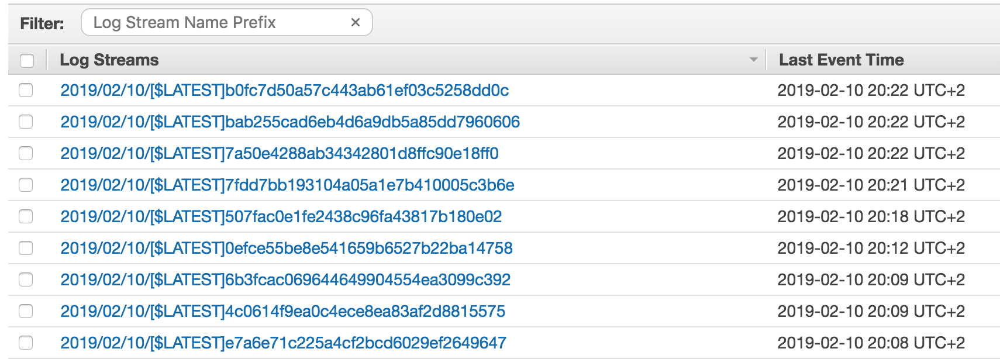
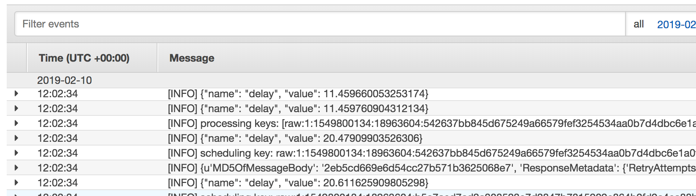
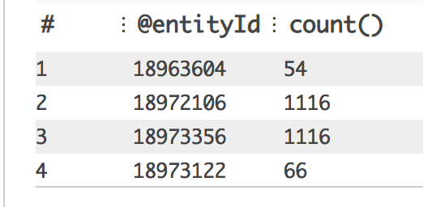
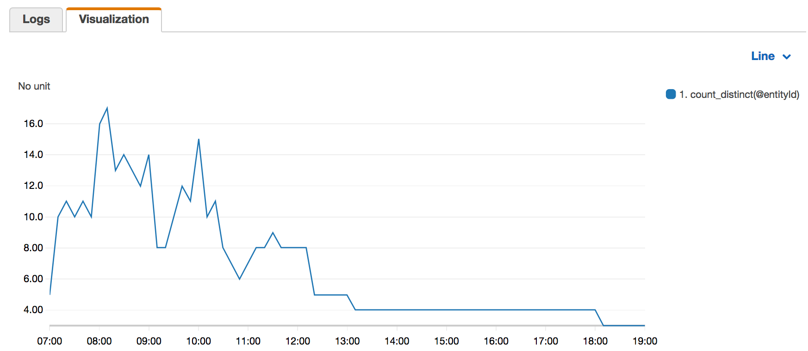

We've been using AWS Lambda in our Data Pipeline in my company. Needless to say the experience so far
has been far from great. Deploying isn't trivial. Debugging is far from trivial. Even logging,
a developer's coarsest debugging buddy, isn't easy.

The way that Lambda logs work, is that they are written to what AWS calls a "Cloudwatch Log Group".
This is basically a stream of events, also randomly partitioned by some sort of time/size factor. 
You first select a "Log Group", which is the output of a certain AWS Lambda, and then you browse
through the log stream:



Let's say that we select one of the log streams, then we see a stream of events (logs):



So these are your log output. Some of them are produced by AWS Lambda on lifecycle events (start, error, end),
but most of these would probably be your `console.log` equivalent. There are several ways 
to filter this log, but with the aid of Insights, we can do some really cool
stuff with it. Take this log line for example:

`[INFO] scheduling key: raw:1:1549824523:18974356:35f991d2d0d21b2c52208ccd53d028d99ed94932bdb368f8c88c290f8f29507b in 15 seconds`

Don't mind the random numbers (they have some significance in our system), but assuming this is a real
formatted log event, with a structure of the following:

`[$level] scheduling key: $keyType:$interval:$ts:$entityId:$contextId in $seconds seconds`

We can use our knowledge of the event to do some interesting manipulations on it, 
let's start with a basic Insights filter (make sure you are working on the correct Log Group):

```text
fields @timestamp, @message
| filter @message like /scheduling key/
| sort @timestamp desc
| limit 20
```

Notice the `filter` clause, this will help us observe only the relevant events. If we get any events
we know that our filter is working correctly.

Next we'll want to extract relevant variables from each event, we don't have to be over-precise, and
focus only on the variables we care about:

```text
fields @timestamp, @message
| filter @message like /scheduling key/
| parse @message 'scheduling key: raw:1:*:*:*' @ts, @entityId, @contextId
| limit 20
```

Notice the `parse` clause. This is the key part of the query. It adds additional variables to the scope
of each message, using `*` as a variable placeholder. Insights isn't strict about the parsing, so we are
able to be very imprecise and focus only on the variables we care about (`@entityId` in this case).

The fun just started. Now we can do basic graph manipulations, some examples:

- Count appearances of each `@entityId`:

```text
fields @timestamp, @message
| filter @message like /scheduling key/
| parse @message 'scheduling key: raw:1:*:*:*' @ts, @entityId, @labelId
| stats count() by @entityId
```



- Plot distinct count of `@entityId` by `10 minute` bins:

```text
fields @timestamp, @message
| filter @message like /scheduling key/
| parse @message 'scheduling key: raw:1:*:*:*' @ts, @entityId, @labelId
| stats count_distinct(@entityId) by bin(10m)
```



So there you go. With very simple examples we can extract and plot very powerful data. 
From the last graph, I deduce there is a decreasing number of entities in the log events over time.
(Off course the specific context matters)

How can this be taken even further? Well besides analytics, you can create Metric Filters, which are
pseudo virtual variables that you can then create alarms and dashboards in Cloudwatch to monitor.

Did you find any exciting usages of Insights? Would love to hear about them, tweet about them and let me know.
