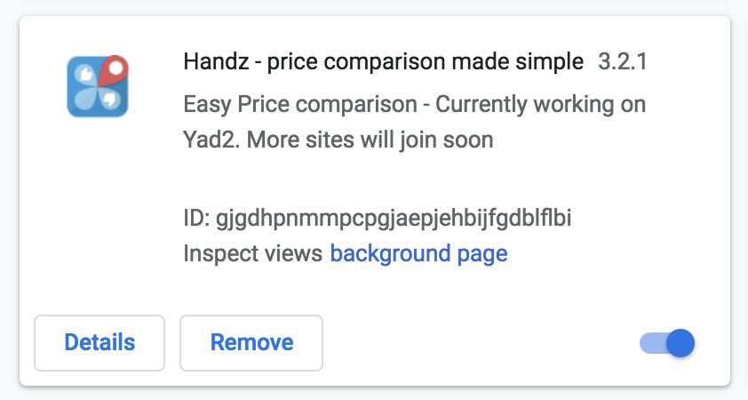
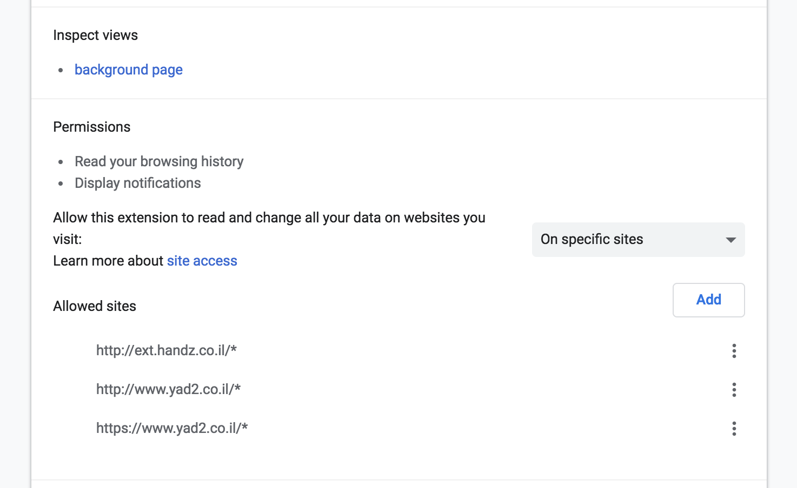

Chrome Extensions have access to a wide range of native Chrome APIs, some which require special permission
from the user, and some are "free" to request. (See [here](https://developer.chrome.com/extensions/declare_permissions))

One of most hated permissions to be requested by a Chrome Extension, is the permission to read your data on websites
you use. There might be legitimate reasons to request this permission, but in most cases I've found it
requested because of:

1. Tracking and analytics
2. Laziness of the developer to limit request to specific sites/domains
3. Preparation for future need. Requesting new permissions will shut down an extension until the user accepts them, causing some extension developers to "prepare" for the future
4. Spying and data mining intents

Again, there might be valid uses for such broad permission, but in my experience, they are either rare,
or come as part of what the extension is selling - safe browsing, or some utility to improve your browsing experience,
in that case it's obvious why the extension wants access to your browsing data.

In any case, it's possible to limit the extension by yourself, if you still want to use it.

1. Goto [chrome://extensions](chrome://extensions) and find your extension 
2. Click on Details
3. Browse down to the `Permissions` section
4. On the right there is a drop down allowing you to toggle between modes of site access. 
5. The safest option (besides disabling/removing the extension) is to select `On click`. This means the extension would work only if you click on it on the right hand icon bar.
6. Your next best option is to select `On specific sites` and enter the sites your want the extension to work on. Sometimes the extension would run communications with it's background page and a 3rd party domain. This is acceptable as long as it's the service backend url, or a known analytics party (and the extension declared it). If the extension is mis-behaving you might need to find this backend url, it's sometimes found in JS errors, or in the background page (Click on the background page to inspect it).

That's it, hopefully this can make someone's life better, it surely did mine!
